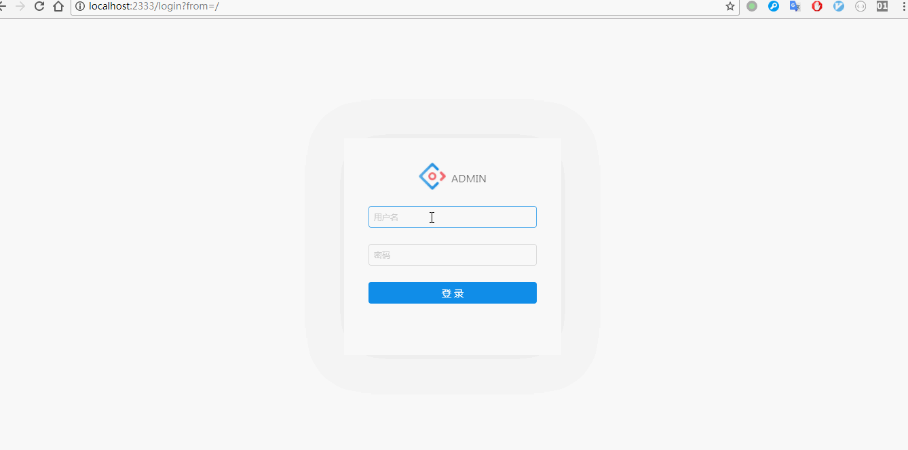

# react-antd
基于 react+redux+antd+webpack+es6 构建的后台管理模板

## 快速开始
克隆项目
```bash
git clone https://github.com/LikaiLee/react-antd.git
```
安装依赖

```bash
npm install
```
开发环境
```bash
npm run dev
```
生产环境
```base
npm run build
```
代码检查
```bash
npm run lint
```
示例



